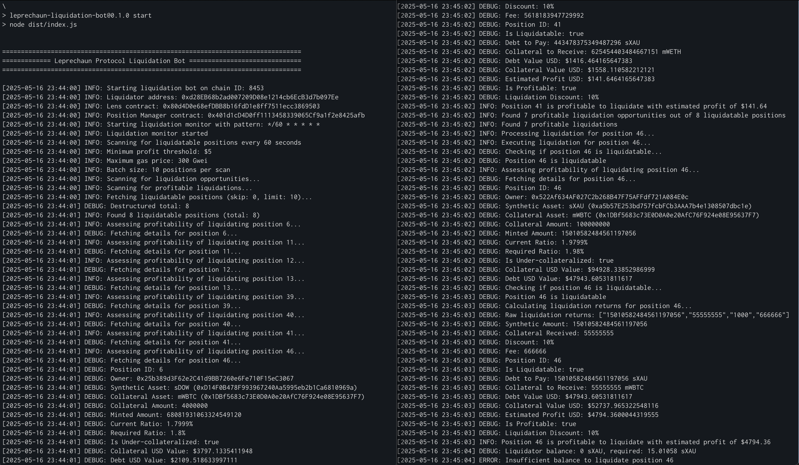

# Leprechaun Protocol Liquidation Bot

A minimal-requirement liquidation bot for the Leprechaun Protocol that uses viem for blockchain interactions. This bot automatically monitors the protocol for under-collateralized positions, assesses their profitability, and executes liquidations when profitable.

Designed for low cost, low overhead and fast warm starts using Vercel Functions. Alternatively, for more control and better debugging, run locally, on your server, or any node-compatible environment.



Redundancy-add and more accessible liquidation layer that adds onto Leprechaun's [liquidation-hook](https://github.com/leprechaun-dao/liquidation-hook) - for more state-of-the-art and DeFi-like liquidations use our hook!

## Features

- 🔍 **Automated Scanning**: The bot periodically scans the protocol for under-collateralized positions using the Lens contract's `getLiquidatablePositions` function.
- 💰 **Profitability Assessment**: For each liquidatable position, the bot calculates whether executing the liquidation would be profitable, considering:
  - The amount of synthetic tokens needed to repay the debt
  - The amount of collateral that would be received
  - The protocol fee
  - The liquidation discount
  - The gas cost of the transaction
  - The minimum profit threshold configured
- ⚡ **Execution**: For positions that are determined to be profitable, the bot:
  - Checks if the liquidator has sufficient synthetic tokens
  - Approves the position manager to spend the tokens if necessary
  - Executes the liquidation by calling the liquidate function
  - Waits for the transaction to be mined and verifies the success
- 📊 **Logging**: Comprehensive logging of all operations
- 🛡️ **Error Handling**: Robust error handling to ensure reliability
- 🔄 **Batch Processing**: Process multiple liquidations concurrently
- 📱 **Vercel Compatible**: Uses viem for simplicity and performance, compatible with Vercel functions
- 🌐 **REST API**: Includes API endpoints for integration with other systems

## Prerequisites

- Node.js v18 or later
- Ethereum private key with some ETH on base for gas
- Synthetic tokens for repaying debt during liquidations

## Installation

1. Clone the repository
2. Install dependencies:

```bash
npm install
```

3. Copy `.env.example` to `.env` and configure the environment variables:

```bash
cp .env.example .env
```

## Configuration

Edit the `.env` file to configure the bot:

```
# Network Configuration
RPC_URL=https://eth-mainnet.alchemyapi.io/v2/your-api-key
CHAIN_ID=1

# Private Key - KEEP THIS SECURE!
LIQUIDATOR_PRIVATE_KEY=your-private-key-here

# Contract Addresses
LENS_CONTRACT_ADDRESS=0x0000000000000000000000000000000000000000
POSITION_MANAGER_ADDRESS=0x0000000000000000000000000000000000000000
FACTORY_ADDRESS=0x0000000000000000000000000000000000000000

# Bot Configuration
SCAN_INTERVAL_SECONDS=60
GAS_LIMIT=1000000
MAX_GAS_PRICE_GWEI=300
MIN_PROFIT_USD=5
BATCH_SIZE=10

# API Security (for Vercel deployment)
API_KEY=your-secret-api-key

# Logging
LOG_LEVEL=info

# Notification (optional)
DISCORD_WEBHOOK_URL=
```

## Usage

### Build the Bot

```bash
npm run build
```

### Start the Bot

```bash
npm start
```


### Run Just a Scanner

To scan for liquidatable positions without executing liquidations:

```bash
npm run scan
```

### Run a Single Liquidation

To execute a single liquidation for a specific position:

```bash
npm run liquidate -- --position-id 123
```

## Architecture

The bot consists of the following key components:

1. **Scanner**: Identifies liquidatable positions and calculates profitability
2. **Liquidator**: Executes liquidations for profitable positions
3. **Monitor**: Schedules scanning and liquidation runs
4. **Utils**: Helper functions for blockchain interactions, logging, and configuration
5. **API**: REST endpoints for Vercel deployment

### Key Files

- `src/index.ts`: Main entry point for running as a standalone service
- `src/scanner.ts`: Scans for liquidatable positions
- `src/liquidator.ts`: Executes liquidations
- `src/monitor.ts`: Schedules and monitors liquidation runs
- `src/api/*.ts`: Serverless function endpoints
- `src/utils/config.ts`: Configuration loading and clients setup
- `src/utils/logger.ts`: Logging utilities
- `src/utils/blockchain.ts`: Blockchain interaction utilities
- `src/utils/tokens.ts`: Token-related utilities

## Deployment as a Vercel Function

The bot can run both as a local service and as a serverless Vercel Function:

### Local Operation

For continuous local operation:
```bash
npm start
```

### Serverless Deployment with Vercel

1. Fork this repository and clone it
2. Install Vercel CLI if not already installed:
   ```bash
   npm i -g vercel
   ```
3. Log in to Vercel:
   ```bash
   vercel login
   ```
4. Link your project:
   ```bash
   vercel link
   ```
5. Add environment variables:
   ```bash
   vercel env add LIQUIDATOR_PRIVATE_KEY
   vercel env add RPC_URL
   ```
   Continue adding all required environment variables from the .env.example file
   
6. Deploy to Vercel:
   ```bash
   npm run deploy
   ```
   
7. Once deployed, your API endpoints will be available at:
   - `/api/health` - Health check and status endpoint
   - `/api/liquidate?action=scan` - Scan for liquidatable positions
   - `/api/liquidate?action=liquidate&positionId=123` - Liquidate a specific position
   - `/api/liquidate?action=scan-and-liquidate` - Scan and execute profitable liquidations

8. For security, all API requests should include your API key:
   ```
   https://your-vercel-url.vercel.app/api/liquidate?action=scan&apiKey=your-api-key
   ```

### Scheduled Executions (For Serverless)

To run the liquidation scanner on a schedule:

1. Go to your Vercel project settings
2. Navigate to "Integrations" -> "Vercel Cron Jobs"
3. Create a new cron job to call your liquidation endpoint
4. Example cron pattern: `*/5 * * * *` (every 5 minutes)
5. Endpoint URL: `https://your-vercel-url.vercel.app/api/liquidate?action=scan-and-liquidate&apiKey=your-api-key`

## Security Considerations

- **Private Key Security**: Never commit your private key to version control
- **Fund Management**: Only keep enough funds for active liquidations
- **Gas Management**: Configure proper ETH gas limits to avoid failed transactions
- **API Security**: Protect your API endpoints with the API_KEY environment variable
- **Rate Limiting**: Be aware of Vercel's serverless function execution limits

## License

MIT
